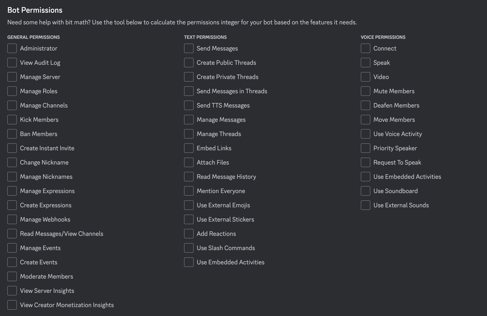

### Discord Bot 作成手順

DiscordDeveloper Portal にログインし、Bot を作成。

- 適切な権限を与える。



### Example

```
.
├── airhorn-message          # エアホーン関連のメッセージを扱う機能
├── component-message        # UIコンポーネントと連動するメッセージの機能
├── contex-menu              # コンテキストメニュー（右クリックメニューなど）の機能
├── embed-message            # 埋め込みメッセージの表示や管理の機能
├── file-message             # ファイル添付メッセージの送受信機能
├── inline-reply             # インラインでの返信機能
├── interaction              # ユーザーとの対話やインタラクションの機能
├── reaction-message         # リアクションを用いたメッセージの操作や通知の機能
├── schedule-event           # イベントのスケジューリングや通知の機能
├── simple-message           # シンプルなテキストメッセージの送受信機能
├── thread-message           # スレッドメッセージの管理や通知の機能
├── tts-message              # テキストを音声に変換して送信する機能
└── voice-bot                # ボイスチャンネルでの音声操作やボットの機能

```
