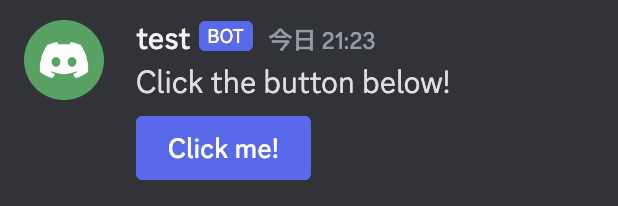
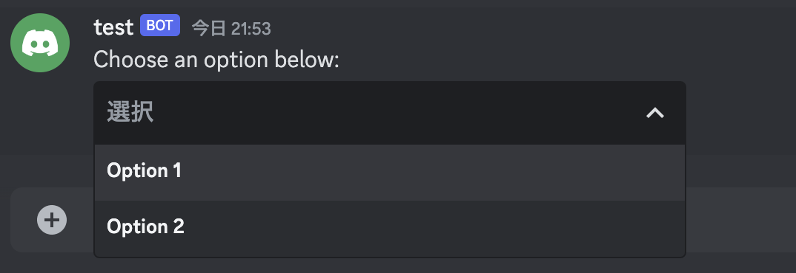
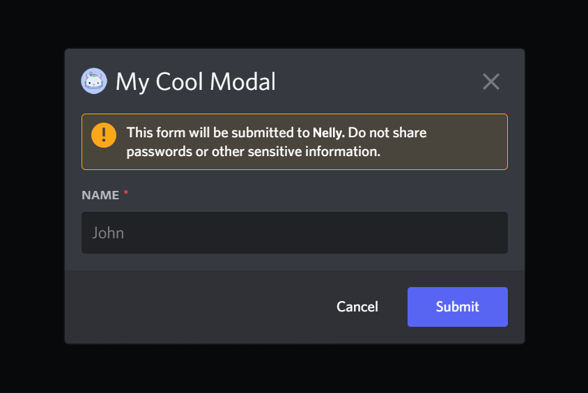

## Component Message

- ボタンやセレクトメニューのようなインタラクティブな要素をメッセージとして送信できる。

  https://discord.com/developers/docs/interactions/message-components#component-object

### ButtonComponent

- メッセージ内で表示されるインタラクティブなボタンコンポーネント
  

```go
&discordgo.MessageComponent{
    Type: discordgo.ButtonComponent,
    Label: "Click Me!",
    Style: discordgo.PrimaryButton, // 例: プライマリーボタン
    CustomID: "button_click",
}
```

- ユーザーがクリックするとアプリにインタラクションを送信
- アクション行の中で送信必要
- アクション行は最大 5 つのボタンを含むことができ、セレクトメニューコンポーネントと同時に含むことはできません

### SelectMenuComponent

- メッセージ内のドロップダウンリストからユーザーがオプションを選択するインタラクティブなコンポーネント
  

```go
&discordgo.MessageComponent{
    &discordgo.SelectMenu{
        CustomID: "select_option",
        Options: []discordgo.SelectMenuOption{
            {
                Label: "Option 1",
                Value: "opt1",
            },
            {
                Label: "Option 2",
                Value: "opt2",
            },
        },
    },
}
```

- シングルセレクトとマルチセレクトをサポート
- アクション行内で送信する必要があり、1 つのアクション行には 1 つのセレクトメニューのみ含めることができます。セレクトメニューとボタンを同時に含むことはできない。

```
UserSelectMenuComponent
RoleSelectMenuComponent
MentionableSelectMenuComponent
ChannelSelectMenuComponent
```

に関しては同じコンポーネント方式で実装されている。

- TextInputComponent

  テキスト入力はモーダルで表示されるインタラクティブなコンポーネント
  
  ※このコンポーネントは interaction のみで利用可能です。

```go
discordgo.TextInput{
    CustomID:    "text_input",
    Placeholder: "Enter some text here",
    Style:       discordgo.TextInputParagraph,
}
```

- 短いフォームまたは長いフォームのテキストの収集に適しています。
