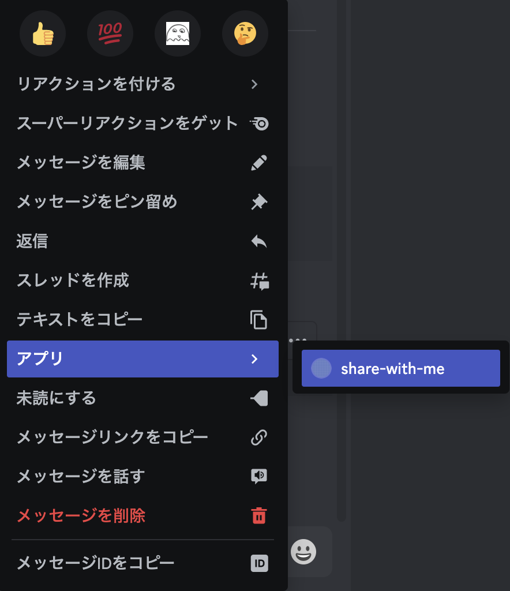

## Simple Text Message

- 右クリックでのメニューを拡張する



```go
func registerContextMenu(s *discordgo.Session, guildID string) {
	// Define the context menu
	cmd := &discordgo.ApplicationCommand{
		Name: "share-with-me",
		Type: discordgo.MessageApplicationCommand,
	}

	_, err := s.ApplicationCommandCreate(s.State.User.ID, guildID, cmd)
	if err != nil {
		log.Println("Failed to create context menu:", err)
	}
}
```
