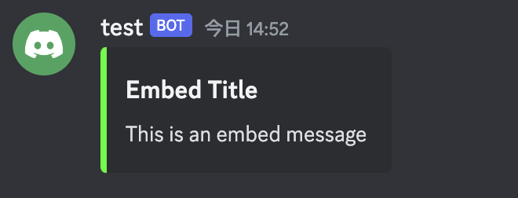
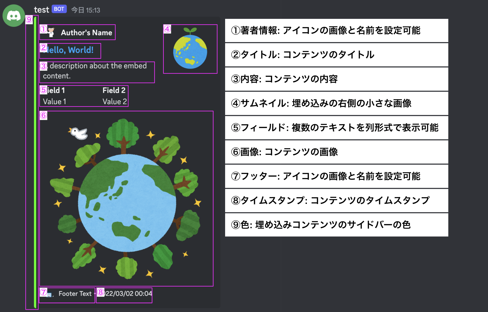

## Embed Text Message

- 埋め込み形式のメッセージを送信する
  

```go
dg, err := discordgo.New("Bot " + TOKEN)
...
embed := &discordgo.MessageEmbed{
    Title:       "Embed Title",
    Description: "This is an embed message",
    Color:       0x00ff00, // Green
}
_, err = dg.ChannelMessageSendEmbed(channelID, embed)
```

- 埋め込み対象はカスタマイズできる。



```go
type MessageEmbed struct {
	URL         string                // 埋め込みコンテンツのURL
	Type        EmbedType             // 埋め込みコンテンツのタイプ
	Title       string                // 埋め込みコンテンツのタイトル
	Description string                // 埋め込みコンテンツの説明
	Timestamp   string                // 埋め込みコンテンツのタイムスタンプ
	Color       int                   // 埋め込みの色。整数でRGB形式で指定
	Footer      *MessageEmbedFooter   // フッター情報
	Image       *MessageEmbedImage    // 画像情報。埋め込みに画像を表示する
	Thumbnail   *MessageEmbedThumbnail// サムネイル情報。埋め込みの右側に小さな画像を表示する
	Video       *MessageEmbedVideo    // ビデオ情報。Discordはビデオを表示しないので、リンクとして表示される
	Provider    *MessageEmbedProvider // プロバイダ情報。YouTubeビデオなどの特殊な埋め込みのため
	Author      *MessageEmbedAuthor   // 著者情報。著者に関する小さな要約を表示するために使用できる
	Fields      []*MessageEmbedField  // 情報を列形式で表示するためのフィールド
}

```
