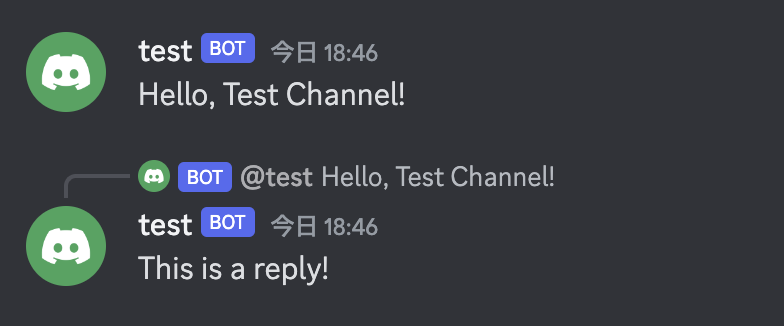

## Reply

- メッセージに対してリプライを送信する



```go
dg, err := discordgo.New("Bot " + TOKEN)
...
m, _ := dg.ChannelMessageSend(channelID, "Hello, Test Channel!")
message := &discordgo.MessageSend{
    Content:   "This is a reply!",
    Reference: &discordgo.MessageReference{MessageID: m.ID},
}
_, err = dg.ChannelMessageSendComplex(channelID, message)
```
