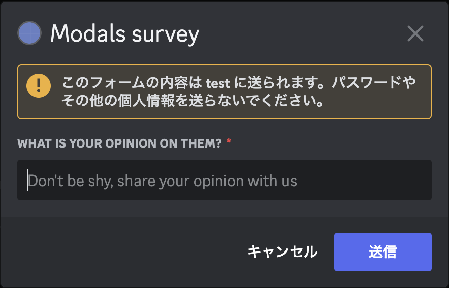

## Interaction

- ボタン、セレクトメニュー、スラッシュコマンドなどのコンポーネントを活用してユーザのアクションに応答することができる機能。

https://discord.com/developers/docs/interactions/receiving-and-responding

### Interaction の種類:

1. **スラッシュコマンド (Slash Commands)**:

   - `/` を使用してコマンドを起動する機能。
   - カスタムコマンドを作成して、特定のアクションや応答をトリガーすることができる。
   - グローバルまたは特定のサーバーでのみ使用するために登録できる。

2. **メッセージコンポーネント (Message Components)**:

   - 前述したコンポーネント(TextInput など)を埋め込むことができる。

3. **コンテキストメニュー (Context Menus)**:
   - ユーザやメッセージに対してカスタムアクションを追加するための右クリックメニュー。
   - スラッシュコマンドと同様の登録と処理フローを持つ。

### 注意点:

- Interaction には応答時間の制限がある。(デフォルトでは 3 秒以内、最大で 15 分の延長が可能)
