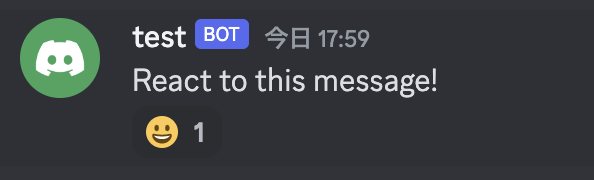
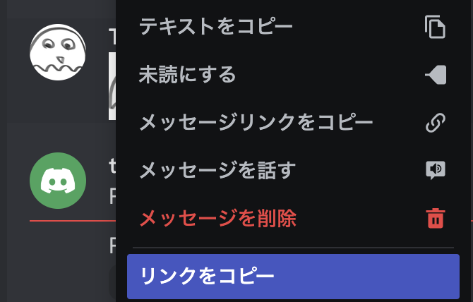

## Reaction To Text Message

- メッセージに対してリアクションを付ける




- リアクションとしてつけられる絵文字は 2 種類あります。
  - `Unicode絵文字`, `カスタム絵文字`

```go
// Unicode絵文字
err = dg.MessageReactionAdd(channelID, message.ID, "😀")

// カスタム絵文字
err = dg.MessageReactionAdd(channelID, message.ID, "emoji_name:emoji_id")
```

- emoji_id はスタンプのリンクから得られる`XXX`の部分です。
  - `https://cdn.discordapp.com/emojis/?XXX.webp`
    
