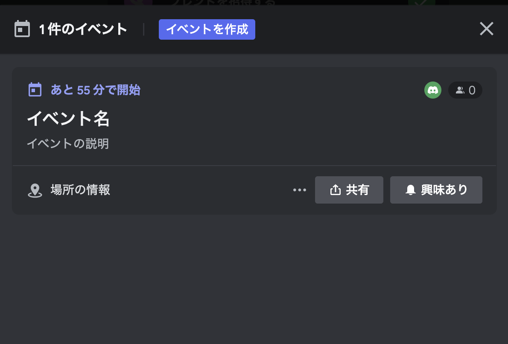

## Schedule Event

- サーバーイベントを登録する



https://discord.com/developers/docs/resources/guild-scheduled-event#create-guild-scheduled-event

```go
dg, err := discordgo.New("Bot " + TOKEN)
...
params := &discordgo.GuildScheduledEventParams{
    Name:               "イベント名",
    Description:        "イベントの説明",
    ScheduledStartTime: &startTime,
    ScheduledEndTime:   &endTime,
    PrivacyLevel:       discordgo.GuildScheduledEventPrivacyLevelGuildOnly,
    EntityType:         discordgo.GuildScheduledEventEntityTypeExternal,
    EntityMetadata:     &discordgo.GuildScheduledEventEntityMetadata{Location: "場所の情報"},
}

// スケジュールイベントを作成
_, err = dg.GuildScheduledEventCreate(guildID, params)
```
