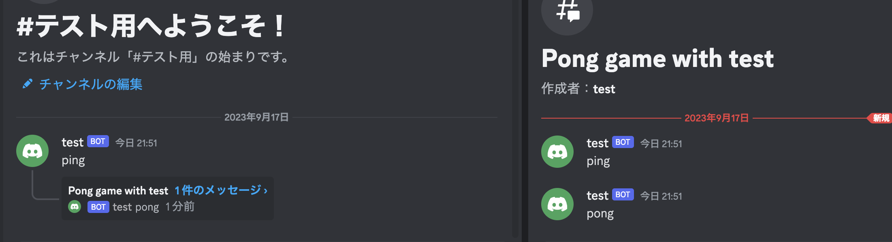

## Thread Text Message

- メッセージに対してスレッドを作成する



```go
thread, err := s.MessageThreadStartComplex(m.ChannelID, m.ID, &discordgo.ThreadStart{
    Name:                "Pong game with " + m.Author.Username,
    AutoArchiveDuration: 60,
    Invitable:           false,
    RateLimitPerUser:    10,
})
if err != nil {
    log.Println("Error starting thread:", err)
    return
}
_, err = s.ChannelMessageSend(thread.ID, "pong")
```
