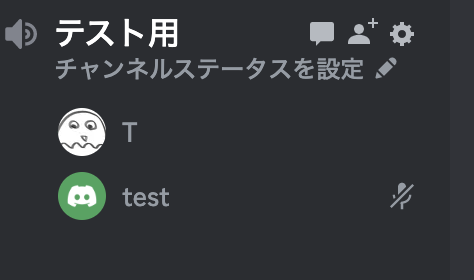

## Voice Bot

サーバー上のボイスチャンネルに参加して、オーディオデータの受信や送信、その他のボイスに関する機能を提供することができる



```go
dg, err := discordgo.New("Bot " + TOKEN)
...
// ボットが参加するギルドとチャンネルの ID、ミュートやスピーカーのステータスなどのオプションを引数として受け取る。
v, err := dg.ChannelVoiceJoin(guildID, channelID, true, false)
```

※ソースでは参加しているボイスチャンネル内の会話を録音する機能を実装

| 機能                                       | 技術的な実装例                                 | 説明                                                                                                                            |
| ------------------------------------------ | ---------------------------------------------- | ------------------------------------------------------------------------------------------------------------------------------- |
| ボイスチャンネルへの参加・退出             | `dg.ChannelVoiceJoin(...)` / `v.Disconnect()`  | Bot がボイスチャンネルに参加・退出するための基本的なメソッド                                                                    |
| 音声の受信                                 | `v.OpusRecv`                                   | Bot が他のユーザーからの音声を受け取るためのメソッド。具体的には PCM データを取得することが可能                                 |
| 音声の送信                                 | `v.OpusSend`                                   | Bot が他のユーザーからの音声を受け取るためのメソッド。具体的には Opus 形式の音声データを受け取る                                |
| ユーザーのミュート制御                     | `dg.GuildMemberMute(...)`                      | 特定のユーザーをミュートにする、またはミュートを解除するためのメソッド                                                          |
| ユーザーの音量調整                         | - (Discord API に直接的なメソッドは存在しない) | ユーザーの音量を調整するための機能。具体的な実装は、音声データを操作して実現することが必要                                      |
| オーディオファイルの再生                   | カスタム実装が必要                             | オーディオファイルを読み込んで、Opus 形式に変換し、`v.OpusSend`を利用してボイスチャンネルに送信する                             |
| ユーザーとのインタラクティブなコマンド処理 | カスタム実装が必要                             | テキストチャンネルでユーザーからのコマンドを受け取り、それに応じて Voice Bot の動作を変更するなどのインタラクティブな処理を実現 |
